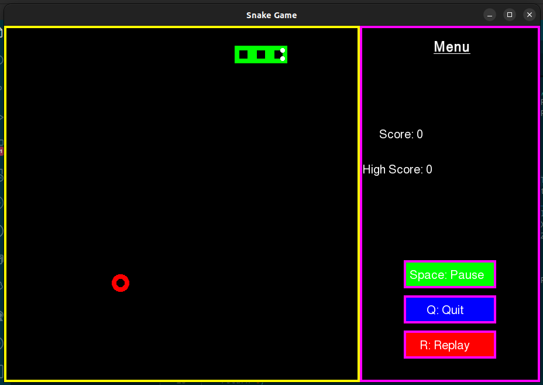
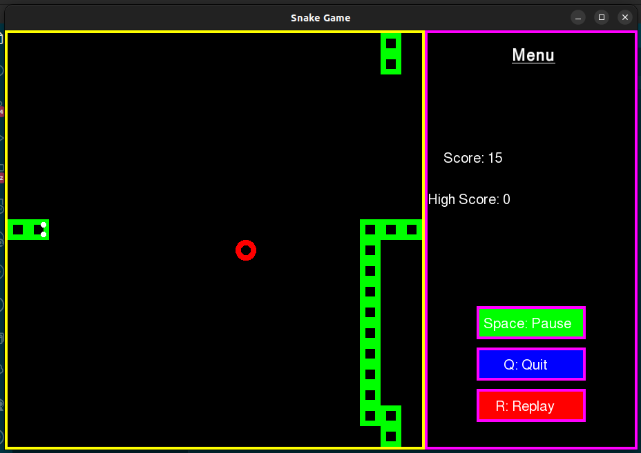
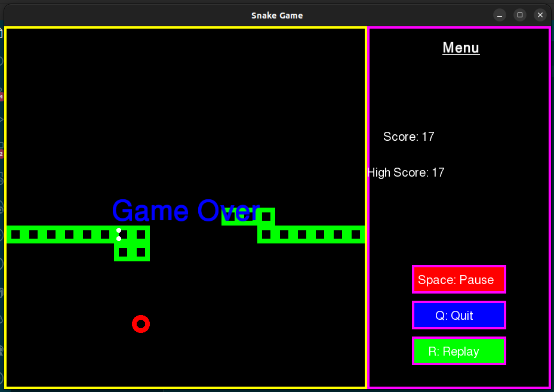
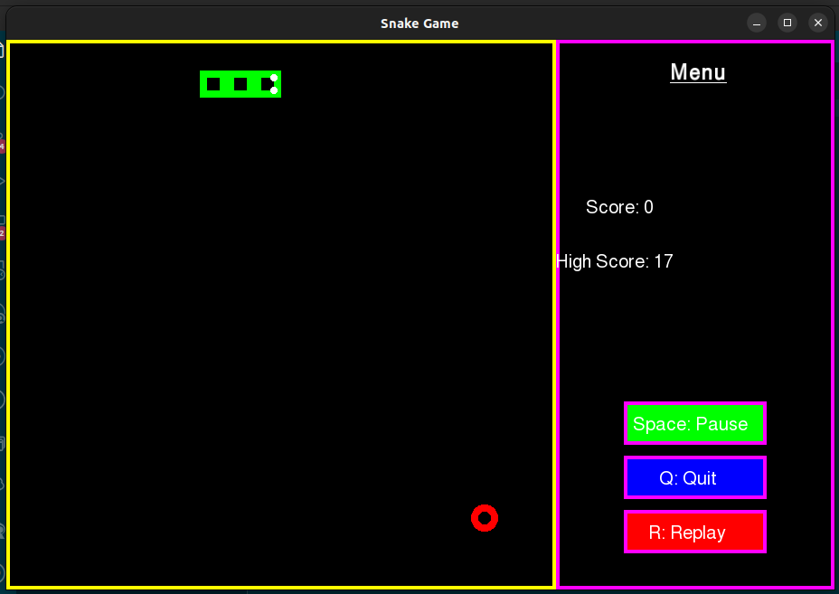

# Snake Game

---

Simple Snake Game with food and scores

Made By: Jaideep Shekhar

## Features:

---

- Control your snake!
- Food randomly generates all over the map.
- Eat all the food!
- Get the highest score!
- Pause functionality!
- Replay Functionality!
- Press Q to quit.

## Showcase:

---

Game Start:

Paused Game:

Game Over:

Replay with high score:

## How to Play
---

### Basic Usage:
---

1. `git clone` the repo.
2. Install the `sfml` library using `sudo apt-get install libsfml-dev`
3. Compile with linked libraries: `g++ -std=c++11 snake.cpp -o snake -lsfml-graphics -lsfml-window -lsfml-system`
4. Play with `./snake`

### Customisations:
---

Almost everything is customisable through constants and parameters.

Notable customisations:

### Snake Color
---

Change the parameter `_bodyColor` to `Snake` class constructor in `snake.cpp`

### Snake Speed
---

Change the constant `SNAKE_SPEED` in `snake.cpp`

## Contact

---

Email: jaideep.dev21@gmail.com
